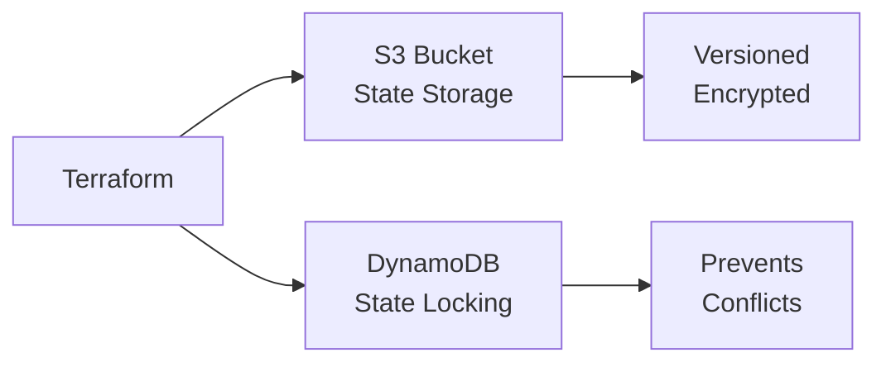

# Terraform Remote State Infrastructure

This Terraform project sets up the necessary AWS infrastructure for remote Terraform state management, providing a secure and reliable way to store and manage your Terraform state files.

## Overview

The project creates the following AWS resources:

- **S3 Bucket**: For storing Terraform state files with versioning enabled
- **S3 Server-Side Encryption**: AES256 encryption for state files at rest
- **DynamoDB Table**: For state locking to prevent concurrent modifications
- **Resource Protection**: Lifecycle rules to prevent accidental destruction

## Architecture



## Prerequisites

- [Terraform](https://www.terraform.io/downloads.html) (v1.0+)
- [AWS CLI](https://aws.amazon.com/cli/) configured with appropriate credentials
- AWS profile with permissions to create S3 buckets and DynamoDB tables

### Required AWS Permissions

Your AWS profile needs the following permissions:

- `s3:*` (for bucket operations)
- `dynamodb:*` (for table operations)

## Configuration

### Variables

| Variable             | Description                                | Default          | Required |
| -------------------- | ------------------------------------------ | ---------------- | -------- |
| `AWS_REGION`         | AWS region for resources                   | `us-east-1`      | No       |
| `AWS_PROFILE`        | AWS CLI profile name                       | `terraform-test` | No       |
| `PROJECT_NAME`       | Project name for tagging                   | -                | **Yes**  |
| `PROJECT_NAME_LOWER` | Lowercase project name for resource naming | -                | **Yes**  |

### Example Configuration

Create a `terraform.tfvars` file:

```hcl
AWS_REGION = "us-east-1"
AWS_PROFILE = "your-aws-profile"
PROJECT_NAME = "YourProject"
PROJECT_NAME_LOWER = "yourproject"
```

## Usage

### 1. Clone and Configure

```bash
# Clone the repository
git clone <repository-url>
cd terraform-remote-state

# Copy the example variables file
cp terraform.example.tfvars terraform.tfvars

# Edit terraform.tfvars with your values
nano terraform.tfvars
```

### 2. Initialize Terraform

```bash
terraform init
```

### 3. Plan the Deployment

```bash
terraform plan -var-file="terraform.tfvars"
```

**Note**: The plan output will show the AWS account information being used, including:

- Account ID
- User/Role ARN
- User ID

This helps verify you're deploying to the correct AWS account.

### 4. Apply the Configuration

```bash
terraform apply -var-file="terraform.tfvars"
```

### 5. Configure Your Project to Use Remote State

After deploying the infrastructure, update your main Terraform project's backend configuration:

```hcl
terraform {
  backend "s3" {
    bucket         = "yourproject-terraform-state-bucket-dev"
    key            = "terraform.tfstate"
    region         = "us-east-1"
    dynamodb_table = "yourproject-terraform-lock-dev"
    encrypt        = true
    profile        = "your-aws-profile"
  }
}
```

## Resource Naming Convention

The project uses the following naming conventions:

- **S3 Bucket**: `{PROJECT_NAME_LOWER}-terraform-state-bucket`
- **DynamoDB Table**: `{PROJECT_NAME_LOWER}-terraform-lock`

Example:

- S3 Bucket: `myproject-terraform-state-bucket`
- DynamoDB Table: `myproject-terraform-lock`

## Cleanup

**⚠️ WARNING**: This action will permanently delete your remote state infrastructure and all stored state files.

To destroy the infrastructure:

```bash
terraform destroy -var-file="terraform.tfvars"
```

Note: The S3 bucket and DynamoDB table have `prevent_destroy` lifecycle rules. You may need to temporarily remove these rules if you want to destroy the resources.

## Troubleshooting

### Common Issues

1. **Permission Denied**: Ensure your AWS profile has the required permissions
2. **Bucket Already Exists**: Choose a unique project name or environment
3. **Region Mismatch**: Ensure your AWS profile region matches the configured region

### State Locking

If a Terraform operation fails and leaves a lock, you can manually remove it:

```bash
aws dynamodb delete-item \
  --table-name yourproject-terraform-lock-dev \
  --key '{"LockID":{"S":"terraform.tfstate"}}' \
  --profile your-aws-profile \
  --region us-east-1
```
